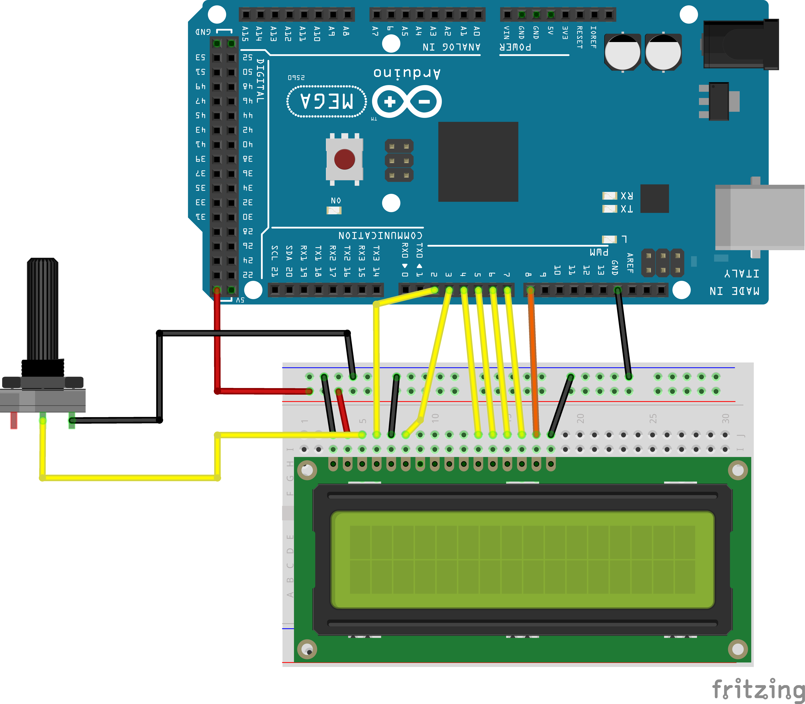

This project demonstrates the use of a 

## Live Demo

## Wiring Diagram

## Circuit Schematic

## Components:
- 1 x Arduino Mega 2560 R3
- 1 x LCD1602 (non-i2c)
- 1 x 10k Potentiometer
- 

## Features:
- 

## Learning Log:
- 
